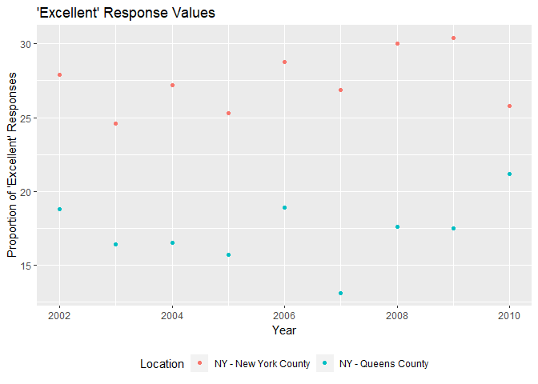

p8105\_hw2\_cj2493
================
Courtney Johnson
September 28, 2018

Problem 1
---------

Read and clean the data; retain line, station name, station latitude/longitude, routes served, entry, vending, entrance type, and ADA compliance. Convert the entry variable from character to logical.

``` r
subway_data = read_csv("./data/NYC_Transit_Subway_Entrance_And_Exit_Data.csv") %>%
  janitor::clean_names() %>%
  select(c(line:entry), vending, ada) %>%
  mutate(entry = recode(entry, "YES" = TRUE, "NO" = FALSE)) 
```

    ## Parsed with column specification:
    ## cols(
    ##   .default = col_character(),
    ##   `Station Latitude` = col_double(),
    ##   `Station Longitude` = col_double(),
    ##   Route8 = col_integer(),
    ##   Route9 = col_integer(),
    ##   Route10 = col_integer(),
    ##   Route11 = col_integer(),
    ##   ADA = col_logical(),
    ##   `Free Crossover` = col_logical(),
    ##   `Entrance Latitude` = col_double(),
    ##   `Entrance Longitude` = col_double()
    ## )

    ## See spec(...) for full column specifications.

Describe the dataset:

This dataset contains information on the NYC subway. Each observation has a station name, the line it's on, its latitude and longitude, the route(s) it serves, if you can enter the station, if there is vending, what type of entrance the station has, and if it is ADA compliant. There is a maximum of 11 routes served for each station.

To clean the dataset, I started by cleaning the names to a lower case and snakecase format. Then I selected all the necessary variables. Because most of the variables we want to keep are all next to each other, we can choose to select most of the variables with a vector. Next, I changed the entry variable to a logical variable with mutate() and recode().

The dataset has 1868 rows and 19 columns. These data are not tidy, because we could gather the routes served and get rid of duplicates.

``` r
subway_distinct_stations = distinct(subway_data, station_name, line, .keep_all = TRUE)
subway_no_vending = filter(subway_distinct_stations, vending == "NO")
```

There are 465 distinct stations. 84 stations are ADA compliant. The proportion of station entrances/exits without vending that allow entrance is 0.5555556.

Here we are asked to make route number and route name distinct variables, so we can do this with the gather step.

``` r
subway_distinct_route = gather(subway_data, key = route_number, value = route, route1:route11) %>%
  filter(route == "A") %>%
  distinct(station_name, line, .keep_all = TRUE) 
```

60 distinct stations serve the A train. Of the stations that serve the A train, 17 are ADA compliant.

Problem 2
---------

Read and clean the Mr. Trash Wheel dataset:

``` r
mr_trash_wheel_data = read_excel("./data/HealthyHarborWaterWheelTotals2018-7-28.xlsx", sheet = "Mr. Trash Wheel", range = cell_cols("A:N")) %>%
  janitor::clean_names() %>%
  filter(!is.na(dumpster), !is.na(date)) %>%
  mutate(sports_balls = as.integer(sports_balls))
```

Read and clean precipitation data for 2016 and 2017:

``` r
precip_17_data = read_xlsx("./data/HealthyHarborWaterWheelTotals2018-7-28.xlsx", sheet  = "2017 Precipitation", range = "A2:B14", col_names = TRUE) %>%
  janitor::clean_names() %>%
  mutate(year = 2017) %>%
  filter(!is.na(total))

precip_16_data = read_xlsx("./data/HealthyHarborWaterWheelTotals2018-7-28.xlsx", sheet  = "2016 Precipitation", range = "A2:B14", col_names = TRUE) %>%
  janitor::clean_names() %>%
  mutate(year = 2016) %>%
  filter(!is.na(total))

precip_data = bind_rows(precip_16_data, precip_17_data) %>%
  mutate(month = month.name[month]) %>%
  select(month, year, total)
```

Describe the data:

The Mr. Trash Wheel dataset has 285 observations of 14 variables. The joined dataset of precipitation in 2016 and 2017 has 24 observations of 3 variables.

The Mr. Trash Wheel dataset includes information on specific dumpsters on specific dates. Some of the variables measured per dumpster include weight in tons, volume in cubic yards, and the amount of specific items in the dumpster, like plastic bottles. The only variables of in the preciptation dataset are month, year, and total precipitation in inches.

The data for precipitation in 2016 has information for 12 months, and the data for precipitation in 2017 has information for 12 months. For available data, the total precipitation in 2017 was 32.93 inches. The median number of sports balls in a dumpster in 2016 is 26.

Problem 3
---------

Load BRFSS data from the p8105.datasets package:

``` r
library(devtools)
devtools::install_github("p8105/p8105.datasets")
```

    ## Skipping install of 'p8105.datasets' from a github remote, the SHA1 (21f5ad1c) has not changed since last install.
    ##   Use `force = TRUE` to force installation

``` r
library(p8105.datasets)
data(brfss_smart2010)
```

Clean the brfss data by formatting data with appropriate variable names, focusing on data about the "Overall Health" topic, excluding variables for class, topic, question, sample size, and everything from lower confidence limit to GeoLocation. Structure data so that values for Response become variables that indicate the proportion of subjects with each response. Create a new variable showing the proportion of responses that were Excellent or Very Good.

``` r
brfss_smart2010 = janitor::clean_names(brfss_smart2010) %>%
  filter(topic == "Overall Health") %>%
  select(-class, -topic, -question, -sample_size, -c(confidence_limit_low:geo_location)) %>%
  spread(key = response, value = data_value) %>%
  janitor::clean_names() %>%
  mutate(excellent_OR_very_good = excellent + very_good)
```

Create manipulated versions of the data in order to better answer questions about the data.

``` r
library(openintro)
```

    ## Please visit openintro.org for free statistics materials

    ## 
    ## Attaching package: 'openintro'

    ## The following object is masked from 'package:ggplot2':
    ## 
    ##     diamonds

    ## The following objects are masked from 'package:datasets':
    ## 
    ##     cars, trees

``` r
location_freq = count(brfss_smart2010, locationdesc)
state_freq = count(brfss_smart2010, locationabbr)
state_most = abbr2state(state_freq[which.max(state_freq$n),1])
```

There are 404 locations included in the dataset. There are 51 states included, so all 50 states and the District of Columbia are represented. The state that is represented the most is New Jersey. In 2002, the median of the "Excellent" response value was 23.6.

Make a histogram of "Excellent" response values in the year 2002:

``` r
library(ggplot2)
ggplot(data = filter(brfss_smart2010, year == 2002), aes(x = excellent)) + geom_histogram() + 
  labs(
    title = "'Excellent' Response Values in 2002",
    x = "Proportion of 'Excellent' Responses",
    y = "Count"
  )
```

    ## `stat_bin()` using `bins = 30`. Pick better value with `binwidth`.

    ## Warning: Removed 2 rows containing non-finite values (stat_bin).


Make a scatterplot showing the proportion of "Excellent" response values in New York County and Queens County in each year from 2002 to 2010:

``` r
ggplot(data = filter(brfss_smart2010, locationdesc == "NY - New York County" | locationdesc == "NY - Queens County"), aes(x = year, y = excellent, color = locationdesc)) + geom_point() +
  labs(
    title = "'Excellent' Response Values",
    x = "Year",
    y = "Proportion of 'Excellent' Responses",
    color = "Location"
  ) +
  theme(legend.position = "bottom")
```


