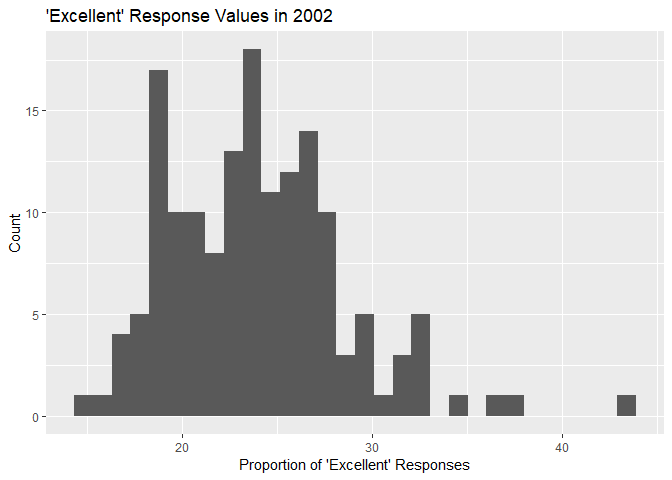

p8105\_hw2\_cj2493
================
Courtney Johnson
September 28, 2018

Problem 1
---------

Read and clean the data, retain line, station name, station latitude/longitude, routes served, entry, vending, entrance type, and ADA compliance. Convert entry variable to logical from character.

``` r
subway_data = read_csv("./data/NYC_Transit_Subway_Entrance_And_Exit_Data.csv") %>%
  janitor::clean_names() %>%
  select(line, station_name, station_latitude, station_longitude, route1, route2, route3, route4, route5, route6, route7, route8, route9, route10, route11, entry, vending, entrance_type, ada) %>%
  mutate(entry = recode(entry, "YES" = TRUE, "NO" = FALSE)) %>%
  gather(key = route_served, value = route, route1:route11)
```

    ## Parsed with column specification:
    ## cols(
    ##   .default = col_character(),
    ##   `Station Latitude` = col_double(),
    ##   `Station Longitude` = col_double(),
    ##   Route8 = col_integer(),
    ##   Route9 = col_integer(),
    ##   Route10 = col_integer(),
    ##   Route11 = col_integer(),
    ##   ADA = col_logical(),
    ##   `Free Crossover` = col_logical(),
    ##   `Entrance Latitude` = col_double(),
    ##   `Entrance Longitude` = col_double()
    ## )

    ## See spec(...) for full column specifications.

Describe the dataset:

This dataset contains information on the NYC subway. Each observation has a station name, the line it's on, the latitude and longitude of the station, the route(s) it serves, if you can enter the station, if there is vending, what type of entrance the station has, and if it is ADA compliant. There is a maximum of 11 routes served for each station. The dataset has 20548 rows and 10 columns. These data could be more tidy by further cleaning the route\_served variable.

``` r
subway_data = distinct(subway_data, station_name, line, .keep_all = TRUE)
subway_no_vending = filter(subway_data, vending == "NO")
```

There are 465 distinct stations. 84 stations are ADA compliant. The proportion of station entrances/exits without vending that allow entrance is 0.5555556.

Problem 2
---------

``` r
mr_trash_wheel_data = read_excel("./data/HealthyHarborWaterWheelTotals2017-9-26.xlsx", sheet = "Mr. Trash Wheel", range = cell_cols("A:N")) %>%
  janitor::clean_names() %>%
  filter(!is.na(dumpster), !is.na(date)) %>%
  mutate(sports_balls = as.integer(sports_balls))
```

``` r
precip_17_data = read_xlsx("./data/HealthyHarborWaterWheelTotals2017-9-26.xlsx", sheet  = "2017 Precipitation", range = "A2:B14", col_names = TRUE) %>%
  janitor::clean_names() %>%
  mutate(year = 2017) %>%
  filter(!is.na(total))

precip_16_data = read_xlsx("./data/HealthyHarborWaterWheelTotals2017-9-26.xlsx", sheet  = "2016 Precipitation", range = "A2:B14", col_names = TRUE) %>%
  janitor::clean_names() %>%
  mutate(year = 2016) %>%
  filter(!is.na(total))

precip_data = left_join(precip_16_data, precip_17_data, by = "month") %>%
  mutate(month = month.name[month])
```

Describe the data:

The data for precipitation in 2016 has information for 3 months, and the data for precipitation in 2017 has information for 3 months. For available data, the total precipitation in 2017 was NA inches. The median number of sports balls in a dumpster in 2016 is 26.

Problem 3
---------

``` r
library(devtools)
devtools::install_github("p8105/p8105.datasets")
```

    ## Skipping install of 'p8105.datasets' from a github remote, the SHA1 (21f5ad1c) has not changed since last install.
    ##   Use `force = TRUE` to force installation

``` r
library(p8105.datasets)
data(brfss_smart2010)
```

``` r
brfss_smart2010 = janitor::clean_names(brfss_smart2010) %>%
  filter(topic == "Overall Health") %>%
  select(-class, -topic, -question, -sample_size, -c(confidence_limit_low:geo_location)) %>%
  spread(key = response, value = data_value) %>%
  janitor::clean_names() %>%
  mutate(excellent_OR_very_good = excellent + very_good)
```

``` r
state_freq = count(brfss_smart2010, locationabbr)
state_most = as.character(state_freq[which.max(state_freq$n),1])
```

There are 404 locations included in the dataset. There are 51 states included, so all 50 states and the District of Columbia are represented. The state that is represented the most is NJ, or New Jersey. In 2002, the median of the "Excellent" response value was 23.6.

``` r
library(ggplot2)
ggplot(data = filter(brfss_smart2010, year == 2002), aes(x = excellent)) + geom_histogram()
```

    ## `stat_bin()` using `bins = 30`. Pick better value with `binwidth`.

    ## Warning: Removed 2 rows containing non-finite values (stat_bin).



``` r
ggplot(data = filter(brfss_smart2010, locationdesc == "NY - New York County" | locationdesc == "NY - Queens County"), aes(x = year, y = excellent, color = locationdesc)) + geom_point()
```


